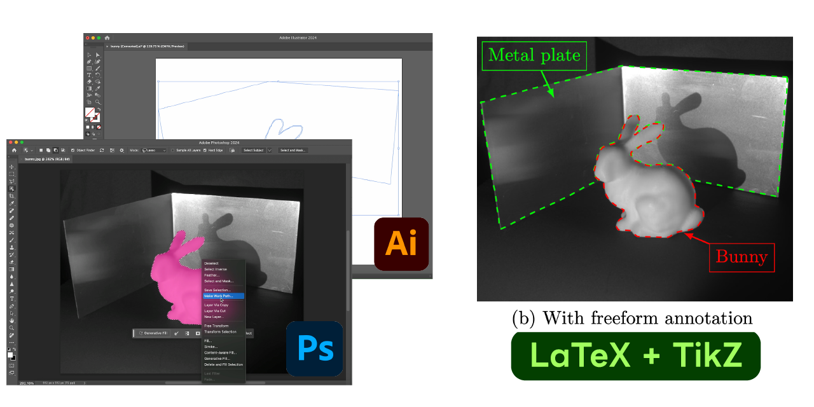

# TikZ Freeform Annotation



Select arbitrary areas using Photoshop's powerful selection tools and export them as paths with Illustrator. This script converts the paths to TikZ code and allows you to annotate the freeform area in your LaTeX document.

## Usage

### Preparation of SVG

1. Select areas using Photoshop.
    - Select a area using the selection tools, such as "Object Selection Tool" or "Lasso Tool."
    - Convert the selection to a path. You can do this by right-clicking on the selection and selecting "Make Work Path...".
    - If you want to select multiple areas, you must drag the work path to the "Create new path" icon in the "Paths" panel or rename the work path to a unique name.
    - Export the path as Illustrator file (.ai) using "File > Export > Paths to Illustrator...". Choose "All Paths" in the dialog.
2. Convert to SVG using Illustrator.
    - Open the exported Illustrator file (.ai) in Illustrator.
    - Save the file as SVG using "File > Export > Export for Screens...". Choose "SVG" in the dialog.

Note that you can use alternative software instead of Photoshop and Illustrator.

### Convert SVG to TikZ

Run the script to convert the SVG file to TikZ code.

```bash
python svg2tikz.py figures/bunny.svg > figures/bunny_annotate.tex
```

The exported TikZ code is as follows (only the part of the path is shown).

```tex
\begin{tikzpicture}[x=\linewidth/612.000, y=-\linewidth/612.000, transform shape]
    \node[above right, inner sep=0] (image) at (0,0) {\includegraphics[width=\hsize]{path to image}};
    \begin{scope}[shift={(image.north west)}]
        \draw[] ++(303.000, 151.000) -- ++(7.000, 0) <!-- and continue... -->;
    \end{scope}
\end{tikzpicture}
```

Rewrite the path to the image (such as `\includegraphics[width=\hsize]{figures/bunny.jpg}`) in the code.

This code can be included in your LaTeX document as a tikzpicture.

### Compile LaTeX

You can compile the LaTeX document as usual.

```tex
\begin{figure}[tbh]
    \centering
    \scalebox{0.98}
    {
        \input{figures/bunny_annotate}
    }
    \caption{Caption}
    \label{fig:label}
\end{figure}
```

If you want to add additional annotations (e.g., text, arrows, etc.), you can add them to the tikzpicture.
